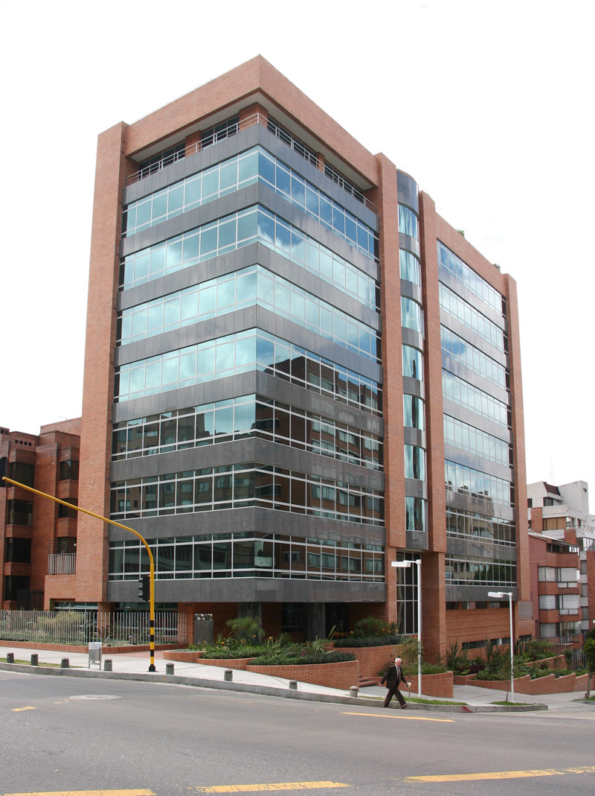

<!DOCTYPE HTML>

<html>
	<head>
	<meta charset="utf-8">
	<meta http-equiv="X-UA-Compatible" content="IE=edge">
	<title>RSG LEGAL</title>
	<meta name="viewport" content="width=device-width, initial-scale=1">
	<meta name="description" content="Free HTML5 Website Template by gettemplates.co" />
	<meta name="keywords" content="free website templates, free html5, free template, free bootstrap, free website template, html5, css3, mobile first, responsive" />
	<meta name="author" content="gettemplates.co" />

  	<!-- Facebook and Twitter integration -->
	<meta property="og:title" content=""/>
	<meta property="og:image" content=""/>
	<meta property="og:url" content=""/>
	<meta property="og:site_name" content=""/>
	<meta property="og:description" content=""/>
	<meta name="twitter:title" content="" />
	<meta name="twitter:image" content="" />
	<meta name="twitter:url" content="" />
	<meta name="twitter:card" content="" />

	<!-- <link href="https://fonts.googleapis.com/css?family=Open+Sans:300,400, 900" rel="stylesheet"> -->
	
	<!-- Animate.css -->
	<link rel="stylesheet" href="css/animate.css">
	<!-- Icomoon Icon Fonts-->
	<link rel="stylesheet" href="css/icomoon.css">
	<!-- Themify Icons-->
	<link rel="stylesheet" href="css/themify-icons.css">
	<!-- Bootstrap  -->
	<link rel="stylesheet" href="css/bootstrap.css">
	<!-- Magnific Popup -->
	<link rel="stylesheet" href="css/magnific-popup.css">
	<!-- Owl Carousel  -->
	<link rel="stylesheet" href="css/owl.carousel.min.css">
	<link rel="stylesheet" href="css/owl.theme.default.min.css">
	<!-- Flexslider -->
	<link rel="stylesheet" href="css/flexslider.css">
	<!-- Theme style  -->
	<link rel="stylesheet" href="css/style.css">
	<link href="images/LOGO_RSG_CON_SLOGAN-removebg-preview.png" rel="icon">

	<!-- Modernizr JS -->
	
	<!-- FOR IE9 below -->
	<!--[if lt IE 9]>
	
	<![endif]-->

	</head>
	<body>
		
	

	
	

	<nav class="gtco-nav" role="navigation">
		

			

				

					
<a href="index.html">RSG<em>LEGAL</em></a>

				

				

					<ul>
						<li class="active"><a href="#" data-nav-section="home">Home</a></li>
						<li><a href="#" data-nav-section="about">Asesoria</a></li>
						<li><a href="#" data-nav-section="practice-areas">Nuestros servicios</a></li>
						<li><a href="#" data-nav-section="our-team">Sobre nosotros</a></li>
						<li class="btn-cta"><a href="#" data-nav-section="contact">Contacto</a></li>
						<!-- For external page link -->
						<!-- <li><a href="http://gettemplates.co/" class="external">External</a></li> -->
					</ul>
				

			

			
		

	</nav>

	<section id="gtco-hero" class="gtco-cover" style="background-image: url(images/cn-el-nogal-2.jpg);"  data-section="home"  data-stellar-background-ratio="0.5">
		

		

			

				

					

						

							<h1 class="animate-box" data-animate-effect="fadeIn">RSG LEGAL, tu socio legal en urbanismo, medio ambiente y propiedad horizontal</h1>
							
<a href="#" class="popup-vimeo"><i class="icon-controller-play"></i></a>

						

					

				

			

		

	</section>
	
	<section id="gtco-about" data-section="about">
		

			

				

					<h1>POR QUÉ ES IMPORTANTE NUESTRA ASESORÍA</h1>
					
Nos comprometemos con el cumplimiento de regulaciones urbanísticas, ambientales y de convivencia. Nuestra asesoría es crucial  para propietarios de empresas, establecimientos de comercio, complejos industriales, comerciales y de vivienda sometidos a propiedad horizontal y entidades del Estado.

						
<a href="Nuestra asesoria.html" class="read-more">Read more <i class="icon-chevron-right"></i></a>
	
					

						
					
ASESORIA

				

			

			

				

					

						
					

				

				

					<h2 class="heading-colored">Nuestra Asesoría</h2>
					
En RSG LEGAL prestamos asesoría legal y técnica en derecho urbano, ambiental y propiedad horizontal. Atendemos procesos sancionatorios y de responsabilidad por afectaciones al medio ambiente, causadas por acciones u omisiones de particulares y del Estado.

						Nos comprometemos a cumplir con las regulaciones urbanísticas, ambientales y de policía, y a defender los derechos de los particulares en sus actividades comerciales, industriales y de servicios.
						

						
De allí que estamos comprometidos a velar por el cumplimiento de las regulaciones urbanísticas, ambientales y de policía consagradas en la Constitución Nacional y en la Ley, y a defender los derechos de los particulares en el desarrollo de sus actividades comerciales, industriales y de servicios. 

					
<a href="Nuestra asesoria.html" class="read-more">Read more <i class="icon-chevron-right"></i></a>

				

			

		

	</section>

	<section id="gtco-practice-areas" data-section="practice-areas">
		

			

				

					<h1>Servicios</h1>
					

					
Nuestros Servicios

				

			

			

				

					

						

							
						

						

							<h3>Asesoría Legal y Técnica en Derecho Urbano</h3>
							
•	Análisis de normas y emisión de conceptos.

							
•	Estudio y definición de la situación legal de la empresa o el establecimiento de comercio.

							
•	Trámites de licencias y permisos.

							
•	Asesoría y representación en procedimientos sancionatorios.

							
•	Acciones legales y constitucionales relacionadas con uso del suelo, salubridad, seguridad, publicidad y permisos.

							
						

					

					

						

							
						

						

							<h3>Asesoría en Derecho Ambiental</h3>
							
•	Estudio y definición de la situación legal.

							
•	Análisis de normas y emisión de conceptos.

							
•	Trámite de permisos y concesiones ambientales.

							
•	Asesoría y representación en procedimientos sancionatorios.

							
•	Asesoría en negociación de conflictos.

							
•	Capacitación e investigación jurídica ambiental.

							
•	Acciones legales y constitucionales relacionadas con el cumplimiento de la normatividad legal.

						

					

					

				

				

					
					

						

							
						

						

							<h3>Asesoría Legal y Técnica en Propiedad Horizontal</h3>
							
•	Estudio y definición de la situación legal.

							
•	Análisis de normas y conceptos.

							
•	Representación en asambleas y procesos verbales sumarios.

							
•	Negociación de conflictos en propiedad horizontal.

							
•	Acciones de tutela y procedimientos sancionatorios.

							
•	Acciones legales y constitucionales relacionadas con el cumplimiento de la normatividad legal.

							

							
						

					

					

					

				

			

		

	</section>

	<section id="gtco-our-team" data-section="our-team">
		

			

				

					<h1>Sobre nosotros</h1>
					

					
Nosotros

				

			

			

				

					

						
					

				

				

					<h2>Porque lo hacemos</h2>
					
Porque, por acción u omisión, los particulares en el desarrollo de una actividad o uso de los recursos naturales, y las entidades estatales (Ministerio del Medio Ambiente, Corporaciones Autónomas Regionales, Planeación Distrital, Secretarías, Alcaldías Distritales y Locales e Inspecciones de Policía), en su labor de supervisión y control, pueden violar el régimen normativo, policivo, de obras, sanitario, de seguridad, de publicidad y convivencia. Estas violaciones pueden amenazar, afectar y deteriorar de manera grave el medio ambiente (suelo, agua, aire y paisaje) o el reglamento de propiedad horizontal que rige las copropiedades de vivienda, comerciales o mixtas.

					
				

			

			

				

					

						
					

				

				

					<h2>Craig Campbell</h2>
					
Lorem ipsum dolor sit amet, consectetur adipisicing elit. Necessitatibus aliquid maiores, voluptatum ex. Accusantium, eum distinctio laudantium. Perferendis dolor, corporis quasi? Tempore quod molestiae quis cumque pariatur dolore vel sit, fugit delectus quasi reprehenderit officia voluptate incidunt, culpa odit impedit qui dolorum fugiat. Quidem possimus reprehenderit, quae recusandae voluptatibus magnam!

					
Ratione facilis quod laborum eaque illo dolore blanditiis nobis dicta voluptatem fugit optio, eveniet non dolor quia delectus, sint, dignissimos atque porro consequuntur unde. Soluta ex necessitatibus delectus saepe aliquam, culpa officiis doloremque, ipsa facere hic, voluptatem accusantium veniam, quasi! Explicabo accusantium sint, corporis consequuntur fugit ipsam, dolorum excepturi adipisci.

				

			

		

	</section>

	<section id="gtco-contact" data-section="contact">
		

			

				

					<h1>Contactanos</h1>
					

					
Contact

				

			

			

				

					<form action="https://formsubmit.co/flashkidsazoom@gmail.com" method="POST" >
						

							<label for="name" class="sr-only">Name</label>
							<input type="text" class="form-control" placeholder="Nombre" name="Name" id="name">
						

						

							<label for="email" class="sr-only">Email</label>
							<input type="text" class="form-control" placeholder="Email" name="Email" id="email">
						

						

							<label for="message" class="sr-only">Message</label>
							<textarea name="message" id="message" class="form-control" cols="30" rows="7" placeholder="Mensage"></textarea>
						

						

							<input type="submit" value="Send Message" class="btn btn-primary">
						

						<input type="hidden" name="_next" value="http://127.0.0.1:5500/">
						<input type="hidden" name="_captcha" value="false">

					</form>
				

				

					

						<ul>
							<li class="address">Avenida Carrera 7 Nro 80 49 oficina 803. Centro de Negocios El Nogal
								Bogotá, Colombia.</li>
							<li class="phone"><a href="tel://5714572846">(571) 457 2846</a></li>
							<li class="email"><a href="info@rsglegal.com">info@rsglegal.com</a></li>
							<li class="url"><a href="https://www.rsglegal.com/es">RSG LEGAL</a></li>
						</ul>
					

				

			

		

	</section>
	
	<footer id="gtco-footer" role="contentinfo">
		

			
			

				

					

						<small class="block">&copy; 2024 Contactenos. All Rights Reserved.</small> 
						
					

					

						<ul class="gtco-social-icons pull-right">
							<li><a href="#"><i class="icon-twitter"></i></a></li>
							<li><a href="#"><i class="icon-facebook"></i></a></li>
							<li><a href="https://www.linkedin.com/in/rsg-legal-3207152b1?utm_source=share&utm_campaign=share_via&utm_content=profile&utm_medium=android_app"><i class="icon-linkedin"></i></a></li>
							<li><a href="#"><i class="icon-dribbble"></i></a></li>
						</ul>
					

				

			

		

	</footer>
	

	

		<a href="#" class="js-gotop"><i class="icon-arrow-up"></i></a>
	

	
	<!-- jQuery -->
	
	<!-- jQuery Easing -->
	
	<!-- Bootstrap -->
	
	<!-- Waypoints -->
	
	<!-- Stellar -->
	
	<!-- Magnific Popup -->
	
	
	<!-- Main -->
	

	</body>
</html>
